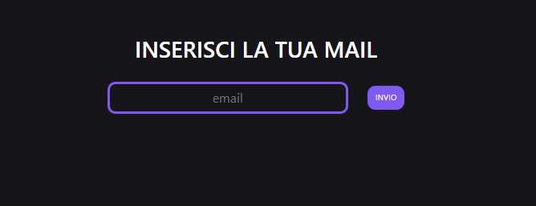

# Email & Dadi

### Esercizio EMAIL

Chiedi all’utente la sua email,
controlla che sia nella lista di chi può accedere,
stampa un messaggio appropriato sull’esito del controllo.

Approccio:

1. Creo un array con le varie mail
2. Chiedi in input all utente di inserire la mail
3. Con un ciclo for controllo se l'input dell'utente corrisponde a una delle mail
4. Stampo un messaggio appropriato in caso di esito positivo

### Esercizio DADI

Generare un numero random da 1 a 6, sia per il giocatore sia per il computer.
Stabilire il vincitore, in base a chi fa il punteggio più alto.

Approccio:

1. Creo 2 variabili e assegno a ognuno un numero casuale generato da math.random
2. Confronto le 2 variabili e quella che ha il numero maggiore vince

